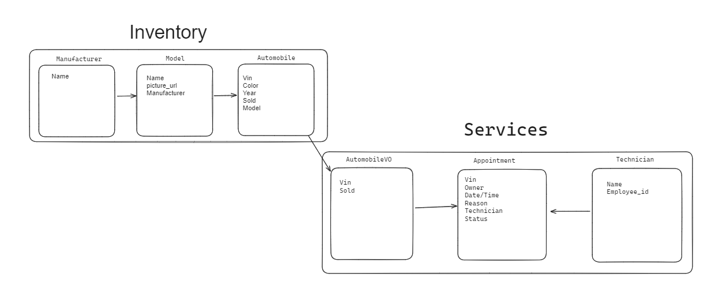

# CarCar

Team:

- Kevin Truong - Services
- Carlos Barrera - Sales

## Instructions to Run the Project

1.) Clone the Repository https://gitlab.com/kevitruon/project-beta
2.) In the directory of the content run the commands (Must have Docker installed)
docker volume create beta-data
docker-compose build
docker-compose up
3.) In your browser use http://localhost:3000/ to interact with the CarCar website
4.) The application loads with an empty database. To fully interact please create the following in order 1. Manufacturer 2. Model 3. Automobile

## Accessing Endpoints to Send and View Data: Access Through Insomnia & Your Browser

## Sale

List Saless | GET | http://localhost:8090/api/sales/

Result : 

Add Sales | POST | http://localhost:8090/api/sales/

Input JSON body : 

Result: 

Delete Sales | DELETE | http://localhost:8090/api/sales/id

Result : 

## Salesperson

List Salesperson | GET | http://localhost:8090/api/salespeople/

Result : 

Add Salesperson | POST | http://localhost:8090/api/salespeople/

Input JSON body : )

Result: 

Delete Salesperson | DELETE | http://localhost:8090/api/salespeople/id

Result : 

## Customer

List Customer | GET | http://localhost:8090/api/customers/

Result : 

Add Customer | POST | http://localhost:8090/api/customers/

Input JSON body : 

Result: 

Delete Customer | DELETE | http://localhost:8090/api/customers/id

Result : 

## Design

Services Diagram: 

Sales Diagram: 

## Service microservice

Three models: AutomobileVO, Technician, Appointment

Appointment model tracks customer name, vin, date/time, and status of created/canceled/finished and assigned Technician

Technician model tracks technician's name and employee_id and has a one to many relationship with the appointment model

AutomobileVO is a value object model which uses a poller to track automobiles in the inventory with vin, href, and sold status

## Sales microservice

Models:

AutomobileVO: Similar to the Service microservice, it tracks automobiles in the inventory with VIN, href, and sold status.

Salesperson: Tracks associate's first name, last name, and employee ID.

Customer: Tracks customer's first name, last name, address, and phone number.

Sale: Tracks sales information including the automobile sold, salesperson involved, customer involved, and the price. It has one-to-many relationships with the Automobile, Salesperson, and Customer models.
