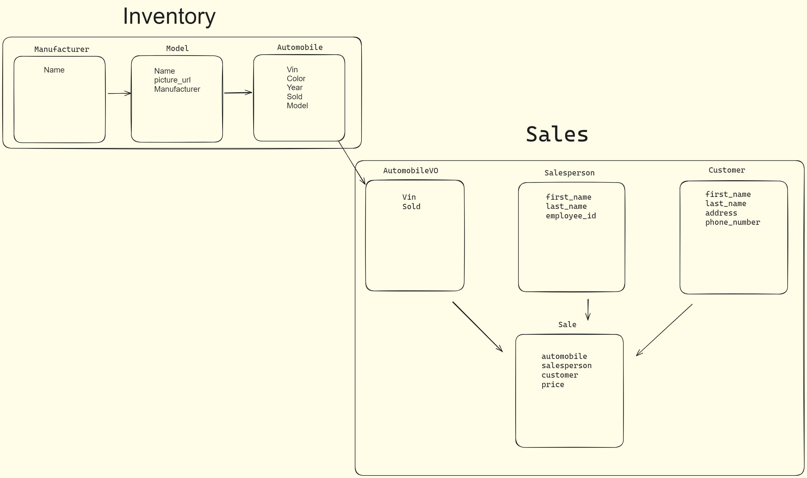

# CarCar

Team:

- Kevin Truong - Services
- Carlos Barrera - Sales

## Design

Services Diagram: 

Sales Diagram: 

## Service microservice

Three models: AutomobileVO, Technician, Appointment

Appointment model tracks customer name, vin, date/time, and status of created/canceled/finished and assigned Technician

Technician model tracks technician's name and employee_id and has a one to many relationship with the appointment model

AutomobileVO is a value object model which uses a poller to track automobiles in the inventory with vin, href, and sold status

## Sales microservice

Models:

AutomobileVO: Similar to the Service microservice, it tracks automobiles in the inventory with VIN, href, and sold status.

Salesperson: Tracks associate's first name, last name, and employee ID.

Customer: Tracks customer's first name, last name, address, and phone number.

Sale: Tracks sales information including the automobile sold, salesperson involved, customer involved, and the price. It has one-to-many relationships with the Automobile, Salesperson, and Customer models.
