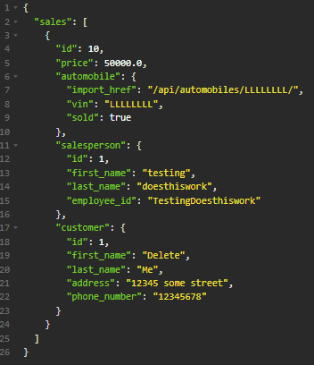
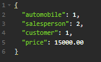
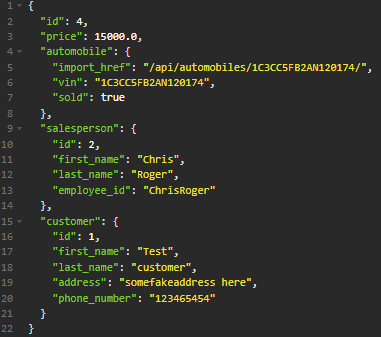
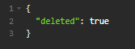
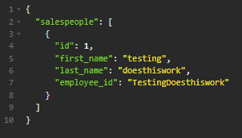
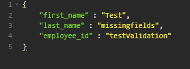
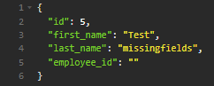
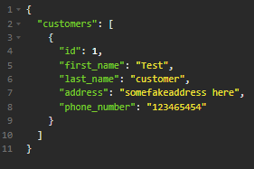
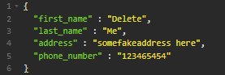
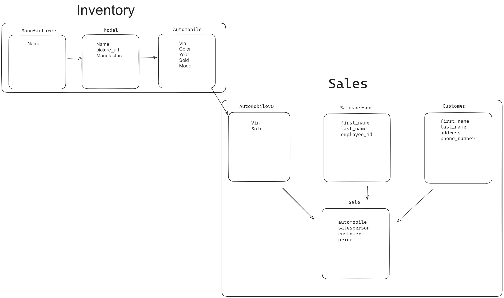

# CarCar

Team:

- Kevin Truong - Services
- Carlos Barrera - Sales

## Instructions to Run the Project

1.) Clone the Repository https://gitlab.com/kevitruon/project-beta  
2.) In the directory of the content run the commands (Must have Docker installed) 
docker volume create beta-data 
docker-compose build 
docker-compose up 
3.) In your browser use http://localhost:3000/ to interact with the CarCar website 
4.) The application loads with an empty database. To fully interact please create the following in order  1. Manufacturer  2. Model  3. Automobile

## Accessing Endpoints to Send and View Data: Access Through Insomnia & Your Browser

| Endpoint           | Method | Description                | URL                                                                                  | Request Payload                                            | Response                                                           |
| ------------------ | ------ | -------------------------- | ------------------------------------------------------------------------------------ | ---------------------------------------------------------- | ------------------------------------------------------------------ |
| **Sale**           |        |                            |                                                                                      |                                                            |                                                                    |
| List Sales         | GET    | View all sales             | [http://localhost:8090/api/sales/](http://localhost:8090/api/sales/)                 |                                                            |                          |
| Add Sales          | POST   | Add a new sale             | [http://localhost:8090/api/sales/](http://localhost:8090/api/sales/)                 |           |           |
| Delete Sales       | DELETE | Delete a sale by ID        | [http://localhost:8090/api/sales/id](http://localhost:8090/api/sales/id)             |                                                            |                          |
| **Salesperson**    |        |                            |                                                                                      |                                                            |                                                                    |
| List Salesperson   | GET    | View all salespeople       | [http://localhost:8090/api/salespeople/](http://localhost:8090/api/salespeople/)     |                                                            |             |
| Add Salesperson    | POST   | Add a new salesperson      | [http://localhost:8090/api/salespeople/](http://localhost:8090/api/salespeople/)     |  |  |
| Delete Salesperson | DELETE | Delete a salesperson by ID | [http://localhost:8090/api/salespeople/id](http://localhost:8090/api/salespeople/id) |                                                            |                    |
| **Customer**       |        |                            |                                                                                      |                                                            |                                                                    |
| List Customer      | GET    | View all customers         | [http://localhost:8090/api/customers/](http://localhost:8090/api/customers/)         |                                                            |                   |
| Add Customer       | POST   | Add a new customer         | [http://localhost:8090/api/customers/](http://localhost:8090/api/customers/)         |       |           |
| Delete Customer    | DELETE | Delete a customer by ID    | [http://localhost:8090/api/customers/id](http://localhost:8090/api/customers/id)     |                                                            |                       |

## Design

Services Diagram: 

Sales Diagram: 

## Service microservice

Three models: AutomobileVO, Technician, Appointment

Appointment model tracks customer name, vin, date/time, and status of created/canceled/finished and assigned Technician

Technician model tracks technician's name and employee_id and has a one to many relationship with the appointment model

AutomobileVO is a value object model which uses a poller to track automobiles in the inventory with vin, href, and sold status

## Sales microservice

Models:

AutomobileVO: Similar to the Service microservice, it tracks automobiles in the inventory with VIN, href, and sold status.

Salesperson: Tracks associate's first name, last name, and employee ID.

Customer: Tracks customer's first name, last name, address, and phone number.

Sale: Tracks sales information including the automobile sold, salesperson involved, customer involved, and the price. It has one-to-many relationships with the Automobile, Salesperson, and Customer models.
